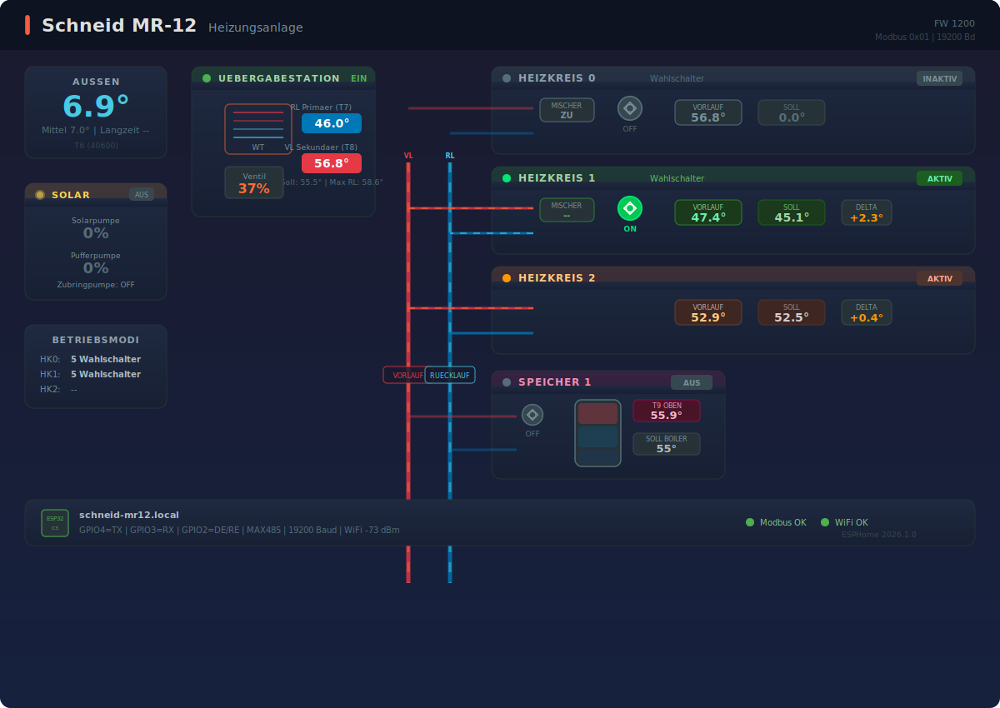

# Schneid MR-12 – Fernwärme Übergabestation

[](https://github.com/hacs/integration)

Vollständiges Open-Source-Projekt für die Integration einer **Schneid MR-12 Fernwärme-Übergabestation** in Home Assistant via ESPHome und Modbus RTU.

## Inhalt

| Ordner | Beschreibung |
|---|---|
| [`esphome/`](esphome/) | ESPHome YAML-Konfiguration (ESP32-C3, RS485/Modbus) |
| [`lovelace/`](lovelace/) | Custom Lovelace Card für Home Assistant |
| [`pcb/`](pcb/) | KiCad-Schaltplan & PCB-Layout (RS485-Adapterplatine) |

---

## Lovelace Card

Visualisiert die Übergabestation in Echtzeit als SVG-Systemdiagramm:

- **Übergabestation** – Primär/Sekundär-Temperaturen, Leistung, Durchfluss, Energie
- **Heizkreis 1** – Vorlauf, Sollwert, Delta, Pumpe (animiert), Mischer
- **Boilerkreis 1** – Speicher-Temperatur, Sollwert, Pumpe (animiert), Füllstandsanzeige
- **Wärmemengenzähler** – Leistung, Durchfluss, Spreizung, Gesamtenergie
- Animierte Rohrleitungen (farbig nach Temperatur) und rotierende Pumpen



### Installation via HACS

1. HACS → ⋮ → **Custom repositories**
2. URL: `https://github.com/<dein-user>/schneid-mr12` · Kategorie: **Lovelace**
3. Karte installieren & HA neu laden

[](https://my.home-assistant.io/redirect/hacs_repository/?owner=Stefan+Gsottbauer&repository=https%3A%2F%2Fgithub.com%2Fgsotti%2Fesphome-schneid-mr12&category=Dashboard)

### Manuelle Installation

```bash
cp lovelace/schneid-mr12-card.js <ha-config>/www/
```

HA → Einstellungen → Dashboards → Ressourcen → `/local/schneid-mr12-card.js` (JavaScript-Modul)

### Karte einbinden

```yaml
type: custom:schneid-mr12-card
title: Fernwärme Übergabestation       # optional
entity_prefix: heating_schneid_mr_12   # optional (Default)
```

---

## ESPHome

**Hardware:** ESP32-C3 + MAX485-Modul → RS485 → Schneid MR-12 (Modbus RTU, 19200 Bd)

```yaml
# secrets.yaml benötigt:
api_encryption_key: "..."
ota_password: "..."
wifi_ssid: "..."
wifi_password: "..."
```

Alle ausgelesenen Register sind in [`esphome/schneid-mr12.yaml`](esphome/schneid-mr12.yaml) dokumentiert.

---

## PCB

KiCad-Projekt für eine kompakte RS485-Adapterplatine (ESP32-C3 → MAX485 → MR-12 Klemmleiste).

---

## Lizenz

MIT
